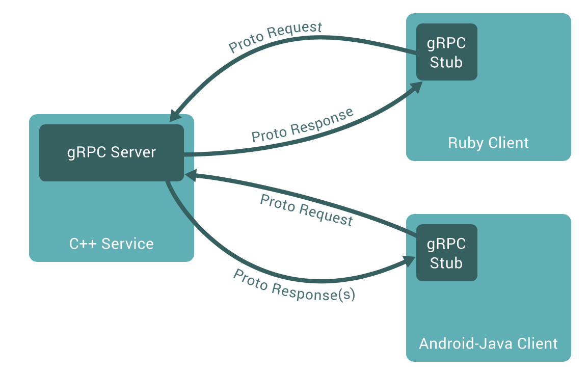

# grpc-demo

grpc从入门到放弃

## RPC
RPC（Remote Procedure Call：远程过程调用）是一种通过网络从远程计算机程序上请求服务的协议。RPC框架的目标就是让远程服务调用更加简单、透明，RPC框架负责屏蔽底层的传输方式（TCP或者UDP）、序列化方式（XML/Json/二进制）和通信细节。服务调用者可以像调用本地接口一样调用远程的服务提供者，而不需要关心底层通信细节和调用过程。我们可以通过一张图来展示rpc的交互过程：


RPC框架实现的几个核心技术点总结如下：
1.远程服务提供者需要以某种形式提供服务调用相关的信息，包括但不限于服务接口定义、数据结构，或者中间态的服务定义文件;
2.远程代理对象：服务调用者调用的服务实际是远程服务的本地代理;
3.通信：RPC 框架与具体的协议无关;
4.序列化：远程通信，需要将对象转换成二进制码流进行网络传输，不同的序列化框架，支持的数据类型、数据包大小、异常类型以及性能等都不同;

业界主流的RPC框架整体上分为三类：
1.支持多语言的RPC框架，比较成熟的有Google的gRPC、Facebook的Thrift；
2.只支持特定语言的RPC框架，例如新浪微博的Motan；
3.支持服务治理等服务化特性的分布式服务框架，其底层内核仍然是RPC框架，例如阿里的Dubbo；

RPC要解决的两个问题：  
1.解决分布式系统中，服务之间的调用问题
2.远程调用时，要能够像本地调用一样方便，让调用者感知不到远程调用的逻辑

## gRPC
gRPC 是Google公司推出的一个高性能、通用的开源 RPC 框架，主要面向移动应用开发并基于 HTTP/2 协议标准而设计，基于 ProtoBuf (Protocol Buffers) 序列化协议开发，由于支持移动端、多语言和 HTTP/2 等新特性，gRPC 在众多开源的 RPC 框架中脱颖而出，除了在谷歌内部长期使用，越来越多的公司也开始使用 gRPC 构建支持多语言的微服务框架。gRPC的调用示例如下：


gRPC特点如下：
1.语言中立，支持多种语言；
2.基于IDL文件定义服务，通过proto3工具生成指定语言的数据结构、服务端接口以及客户端Stub；
3.通信协议基于标准的HTTP/2设计，支持双向流、消息头压缩、单TCP的多路复用、服务端推送等特性，这些特性使得gRPC在移动端设备上更加省电和节省网络流量；
4.序列化支持PB（Protocol Buffer）和JSON，PB是一种语言无关的高性能序列化框架，基于HTTP/2 + PB,保障了RPC调用的高性能;

### gRPC实践
#### 定义proto
```
// greeter/greeter.proto
syntax = "proto3";
 
package greeter;
 
service Greeter {
 rpc SayHello (HelloRequest) returns (HelloReply) {}
}
 
message HelloRequest {
  string name = 1;
}
 
message HelloReply {
  string message = 1;
}
```
然后使用protoc生成对应的Go文件：
```
protoc -I greeter/ greeter/greeter.proto --go_out=plugins=grpc:greeter
```
生成的greeter.pb.go文件如下：
```
// Code generated by protoc-gen-go. DO NOT EDIT.
// source: proto/greeter.proto
 
package greeter
 
import (
   context "context"
   fmt "fmt"
   proto "github.com/golang/protobuf/proto"
   grpc "google.golang.org/grpc"
   codes "google.golang.org/grpc/codes"
   status "google.golang.org/grpc/status"
   math "math"
)
 
// Reference imports to suppress errors if they are not otherwise used.
var _ = proto.Marshal
var _ = fmt.Errorf
var _ = math.Inf
 
// This is a compile-time assertion to ensure that this generated file
// is compatible with the proto package it is being compiled against.
// A compilation error at this line likely means your copy of the
// proto package needs to be updated.
const _ = proto.ProtoPackageIsVersion3 // please upgrade the proto package
 
// The request message containing the user's name.
type HelloRequest struct {
   Name                 string   `protobuf:"bytes,1,opt,name=name,proto3" json:"name,omitempty"`
   XXX_NoUnkeyedLiteral struct{} `json:"-"`
   XXX_unrecognized     []byte   `json:"-"`
   XXX_sizecache        int32    `json:"-"`
}
 
func (m *HelloRequest) Reset()         { *m = HelloRequest{} }
func (m *HelloRequest) String() string { return proto.CompactTextString(m) }
func (*HelloRequest) ProtoMessage()    {}
func (*HelloRequest) Descriptor() ([]byte, []int) {
   return fileDescriptor_8a2d8b56b5ea0dd4, []int{0}
}
 
func (m *HelloRequest) XXX_Unmarshal(b []byte) error {
   return xxx_messageInfo_HelloRequest.Unmarshal(m, b)
}
func (m *HelloRequest) XXX_Marshal(b []byte, deterministic bool) ([]byte, error) {
   return xxx_messageInfo_HelloRequest.Marshal(b, m, deterministic)
}
func (m *HelloRequest) XXX_Merge(src proto.Message) {
   xxx_messageInfo_HelloRequest.Merge(m, src)
}
func (m *HelloRequest) XXX_Size() int {
   return xxx_messageInfo_HelloRequest.Size(m)
}
func (m *HelloRequest) XXX_DiscardUnknown() {
   xxx_messageInfo_HelloRequest.DiscardUnknown(m)
}
 
var xxx_messageInfo_HelloRequest proto.InternalMessageInfo
 
func (m *HelloRequest) GetName() string {
   if m != nil {
      return m.Name
   }
   return ""
}
 
// The response message containing the greetings
type HelloReply struct {
   Message              string   `protobuf:"bytes,1,opt,name=message,proto3" json:"message,omitempty"`
   XXX_NoUnkeyedLiteral struct{} `json:"-"`
   XXX_unrecognized     []byte   `json:"-"`
   XXX_sizecache        int32    `json:"-"`
}
 
func (m *HelloReply) Reset()         { *m = HelloReply{} }
func (m *HelloReply) String() string { return proto.CompactTextString(m) }
func (*HelloReply) ProtoMessage()    {}
func (*HelloReply) Descriptor() ([]byte, []int) {
   return fileDescriptor_8a2d8b56b5ea0dd4, []int{1}
}
 
func (m *HelloReply) XXX_Unmarshal(b []byte) error {
   return xxx_messageInfo_HelloReply.Unmarshal(m, b)
}
func (m *HelloReply) XXX_Marshal(b []byte, deterministic bool) ([]byte, error) {
   return xxx_messageInfo_HelloReply.Marshal(b, m, deterministic)
}
func (m *HelloReply) XXX_Merge(src proto.Message) {
   xxx_messageInfo_HelloReply.Merge(m, src)
}
func (m *HelloReply) XXX_Size() int {
   return xxx_messageInfo_HelloReply.Size(m)
}
func (m *HelloReply) XXX_DiscardUnknown() {
   xxx_messageInfo_HelloReply.DiscardUnknown(m)
}
 
var xxx_messageInfo_HelloReply proto.InternalMessageInfo
 
func (m *HelloReply) GetMessage() string {
   if m != nil {
      return m.Message
   }
   return ""
}
 
func init() {
   proto.RegisterType((*HelloRequest)(nil), "greeter.HelloRequest")
   proto.RegisterType((*HelloReply)(nil), "greeter.HelloReply")
}
 
func init() { proto.RegisterFile("proto/greeter.proto", fileDescriptor_8a2d8b56b5ea0dd4) }
 
var fileDescriptor_8a2d8b56b5ea0dd4 = []byte{
   // 139 bytes of a gzipped FileDescriptorProto
   0x1f, 0x8b, 0x08, 0x00, 0x00, 0x00, 0x00, 0x00, 0x02, 0xff, 0xe2, 0x12, 0x2e, 0x28, 0xca, 0x2f,
   0xc9, 0xd7, 0x4f, 0x2f, 0x4a, 0x4d, 0x2d, 0x49, 0x2d, 0xd2, 0x03, 0xf3, 0x84, 0xd8, 0xa1, 0x5c,
   0x25, 0x25, 0x2e, 0x1e, 0x8f, 0xd4, 0x9c, 0x9c, 0xfc, 0xa0, 0xd4, 0xc2, 0xd2, 0xd4, 0xe2, 0x12,
   0x21, 0x21, 0x2e, 0x96, 0xbc, 0xc4, 0xdc, 0x54, 0x09, 0x46, 0x05, 0x46, 0x0d, 0xce, 0x20, 0x30,
   0x5b, 0x49, 0x8d, 0x8b, 0x0b, 0xaa, 0xa6, 0x20, 0xa7, 0x52, 0x48, 0x82, 0x8b, 0x3d, 0x37, 0xb5,
   0xb8, 0x38, 0x31, 0x1d, 0xa6, 0x08, 0xc6, 0x35, 0x72, 0xe6, 0x62, 0x77, 0x87, 0x18, 0x2b, 0x64,
   0xc1, 0xc5, 0x11, 0x9c, 0x58, 0x09, 0xd6, 0x25, 0x24, 0xaa, 0x07, 0xb3, 0x1b, 0xd9, 0x26, 0x29,
   0x61, 0x74, 0xe1, 0x82, 0x9c, 0x4a, 0x25, 0x86, 0x24, 0x36, 0xb0, 0x03, 0x8d, 0x01, 0x01, 0x00,
   0x00, 0xff, 0xff, 0x8e, 0x86, 0x53, 0xff, 0xb7, 0x00, 0x00, 0x00,
}
 
// Reference imports to suppress errors if they are not otherwise used.
var _ context.Context
var _ grpc.ClientConn
 
// This is a compile-time assertion to ensure that this generated file
// is compatible with the grpc package it is being compiled against.
const _ = grpc.SupportPackageIsVersion4
 
// GreeterClient is the client API for Greeter service.
//
// For semantics around ctx use and closing/ending streaming RPCs, please refer to https://godoc.org/google.golang.org/grpc#ClientConn.NewStream.
type GreeterClient interface {
   // Sends a greeting
   SayHello(ctx context.Context, in *HelloRequest, opts ...grpc.CallOption) (*HelloReply, error)
}
 
type greeterClient struct {
   cc *grpc.ClientConn
}
 
func NewGreeterClient(cc *grpc.ClientConn) GreeterClient {
   return &greeterClient{cc}
}
 
func (c *greeterClient) SayHello(ctx context.Context, in *HelloRequest, opts ...grpc.CallOption) (*HelloReply, error) {
   out := new(HelloReply)
   err := c.cc.Invoke(ctx, "/greeter.Greeter/SayHello", in, out, opts...)
   if err != nil {
      return nil, err
   }
   return out, nil
}
 
// GreeterServer is the server API for Greeter service.
type GreeterServer interface {
   // Sends a greeting
   SayHello(context.Context, *HelloRequest) (*HelloReply, error)
}
 
// UnimplementedGreeterServer can be embedded to have forward compatible implementations.
type UnimplementedGreeterServer struct {
}
 
func (*UnimplementedGreeterServer) SayHello(ctx context.Context, req *HelloRequest) (*HelloReply, error) {
   return nil, status.Errorf(codes.Unimplemented, "method SayHello not implemented")
}
 
func RegisterGreeterServer(s *grpc.Server, srv GreeterServer) {
   s.RegisterService(&_Greeter_serviceDesc, srv)
}
 
func _Greeter_SayHello_Handler(srv interface{}, ctx context.Context, dec func(interface{}) error, interceptor grpc.UnaryServerInterceptor) (interface{}, error) {
   in := new(HelloRequest)
   if err := dec(in); err != nil {
      return nil, err
   }
   if interceptor == nil {
      return srv.(GreeterServer).SayHello(ctx, in)
   }
   info := &grpc.UnaryServerInfo{
      Server:     srv,
      FullMethod: "/greeter.Greeter/SayHello",
   }
   handler := func(ctx context.Context, req interface{}) (interface{}, error) {
      return srv.(GreeterServer).SayHello(ctx, req.(*HelloRequest))
   }
   return interceptor(ctx, in, info, handler)
}
 
var _Greeter_serviceDesc = grpc.ServiceDesc{
   ServiceName: "greeter.Greeter",
   HandlerType: (*GreeterServer)(nil),
   Methods: []grpc.MethodDesc{
      {
         MethodName: "SayHello",
         Handler:    _Greeter_SayHello_Handler,
      },
   },
   Streams:  []grpc.StreamDesc{},
   Metadata: "proto/greeter.proto",
}
```
#### 创建服务端代码
```
package main
 
import (
   "context"
   "fmt"
   "github.com/gin-gonic/gin"
   pb "github.com/zhulinwei/grpc-demo/helloworld/greeter/proto"
   "google.golang.org/grpc"
   "log"
   "net"
)
 
type Greeter struct{}
 
type GreeterServer struct{}
 
const (
   rpcPort    = ":8080"
   ginPort    = ":8081"
)
 
// 注意需要按照greeter.proto生成后的greeter.pb.go格式传参
func (g *Greeter) SayHello(ctx context.Context, req *pb.HelloRequest) (*pb.HelloReply, error) {
   return &pb.HelloReply{Message: "Hello " + req.Name}, nil
}
 
func (GreeterServer) Run(port string) {
   listener, err := net.Listen("tcp", port)
   if err != nil {
      log.Fatalf("failed to listen: %v", err)
   }
   server := grpc.NewServer()
   pb.RegisterGreeterServer(server, &Greeter{})
   if err := server.Serve(listener); err != nil {
      log.Fatalf("failed to serve: %v", err)
   }
}
 
func main() {
   go func() {
      new(GreeterServer).Run(rpcPort)
   }()
   if err := gin.Default().Run(ginPort); err != nil {
      fmt.Println(err)
   }
}
```
我们让gRPC与Web服务端共存，但此时监听的是不同端口。

#### 创建客户端代码
```
package main
 
import (
   "context"
   "fmt"
   "github.com/gin-gonic/gin"
   pb "github.com/zhulinwei/grpc-demo/helloworld/gin/proto"
   "google.golang.org/grpc"
   "log"
   "net/http"
   "time"
)
 
const (
   port = ":3000"
   rpcAddress = "localhost:8080"
)
 
func main () {
   route := gin.Default()
   route.GET("/api/grpc/:name", func(content *gin.Context) {
      conn, err := grpc.Dial(rpcAddress, grpc.WithInsecure())
      if err != nil {
         log.Fatal("did not connect: %v", err)
      }
      ctx, cancel := context.WithTimeout(context.Background(), time.Second)
      defer cancel()
 
      name := content.Param("name")
      req := &pb.HelloRequest{Name: name}
      fmt.Println(name)
 
      greeterClient := pb.NewGreeterClient(conn)
      result, err := greeterClient.SayHello(ctx, req)
      fmt.Println(result)
      if err != nil {
         content.JSON(http.StatusInternalServerError, gin.H{
            "error": err.Error(),
         })
         return
      }
      content.JSON(http.StatusOK, gin.H{
         "result": fmt.Sprint(result.Message),
      })
      if err := conn.Close(); err != nil {
         log.Fatal("close connect fail: %v", err)
      }
   })
 
   if err := route.Run(port); err != nil {
      log.Fatal("gin run fail: %v", err)
   }
}
```

通过调用/api/grpc/:name接口，客户端可通过gRPC的方式获取对应的结果。

